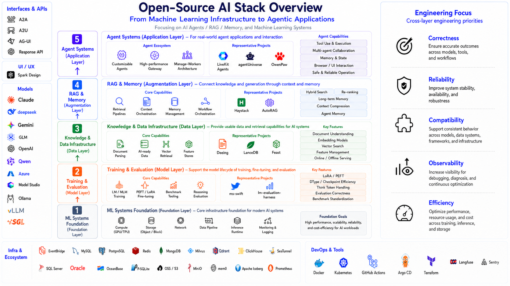

# Yaodong Shen 

> Machine Learning Researcher · Agent Builder · Open-source Contributor

  
  
  
  

I build and study dependable AI systems—from learning under noisy and long-tailed labels, to retrieval, memory, and agentic applications. This page is a compact map of the work I am actively connecting across research and open source.

## ✨ Quick Facts

可以在Quick Facts 中 加入

- 🛠️ I’m a serial entrepreneur exploring **AI × Hardware**. My current venture focuses on **AI-driven sleep intervention** and was selected for incubation within **Prof. Zexiang Li’s entrepreneurship ecosystem behind DJI and XbotPark**, with **RMB 500K in initial funding**.  放在 第一条
- 🎓 M.S. student in **Software Engineering at Southeast University** ([QS World University Rankings 2026: #392](https://www.topuniversities.com/universities/southeast-university)), previously B.Eng. in **Computer Science at Hohai University** ([QS World University Rankings 2026: #1001–1200](https://www.topuniversities.com/universities/hohai-university)).
- 🧠 My work focuses on **Agent Memory**, **Agent Systems**, and **Learning under Imperfect Data**.
- 📄 Research interests include **long-tail learning, partial-label learning, noisy supervision, and robust machine learning**.
- 🛠️ Contributor to open-source AI projects including **QwenPaw, ms-swift, LanceDB, Docling, Feast**, and more.
- 🚀 I enjoy building across **research, engineering, and real-world deployment**.
- 🤝 Open to collaboration on **Agent, LLM, recommendation, and ML systems**.
- 📫 Reach me at: **[yaodong.shen@seu.edu.cn](mailto:yaodong.shen@seu.edu.cn)**

## What I Believe

### 01 — Agent is an architecture, not a model.

Underlying models will keep evolving — **from today’s LLMs to future World Models and beyond** — but the core problems around **Memory, Context, Tool Use, and Runtime** will remain fundamental to intelligent agents.

### 02 — Machine Learning is the transferable foundation.

Model paradigms will continue to change, but a solid foundation in **Machine Learning** determines how quickly one can understand, adapt to, and build with new technologies.

## Open-Source AI Stack · Personal Focus

  

| Layer | What I work on | Connected open-source projects |
| --- | --- | --- |
| **Agent Systems** | Agent building, multi-agent collaboration, real-time multimodal interaction | [QwenPaw](https://github.com/agentscope-ai/QwenPaw) · [LiveKit Agents](https://github.com/livekit/agents) · [agentUniverse](https://github.com/agentuniverse-ai/agentUniverse) |
| **Memory & Retrieval** | RAG orchestration, local-first memory, document understanding and retrieval | [Haystack](https://github.com/deepset-ai/haystack) · [AutoRAG](https://github.com/Marker-Inc-Korea/AutoRAG) · [Basic Memory](https://github.com/basicmachines-co/basic-memory) · [LanceDB](https://github.com/lancedb/lancedb) · [Docling](https://github.com/docling-project/docling) |
| **Learning & Evaluation** | Partial-label learning, long-tail robustness, model training and evaluation | [ms-swift](https://github.com/modelscope/ms-swift) · [LM Evaluation Harness](https://github.com/EleutherAI/lm-evaluation-harness) |
| **ML Systems Foundation** | Reusable data and feature infrastructure | [Feast](https://github.com/feast-dev/feast) |

## Research

| Work | Focus | Current status |
| --- | --- | --- |
| **AdapMatch** | Adaptive bias decoupling for semi-supervised partial-label learning under unknown class distributions | Under review · NeurIPS 2026 · Student first author |
| **Three Stones, One Bird** | Generalization-error-bound-guided noisy partial-label learning | Under review · TPAMI 2026 · Student first author |

## Selected Open-Source Contributions

Every entry below links to a merged pull request. I keep the scope broad deliberately: the projects form the systems map above, rather than a collection of isolated patches.

| Project | Contribution area | Merged PR |
| --- | --- | --- |
| [Docling](https://github.com/docling-project/docling) | Document parsing and structured conversion | [#3954](https://github.com/docling-project/docling/pull/3954) |
| [QwenPaw](https://github.com/agentscope-ai/QwenPaw) | Personal AI agent and extensible skills | [#6502](https://github.com/agentscope-ai/QwenPaw/pull/6502) |
| [Haystack](https://github.com/deepset-ai/haystack) | LLM-agent and RAG orchestration | [#12218](https://github.com/deepset-ai/haystack/pull/12218) |
| [ms-swift](https://github.com/modelscope/ms-swift) | LLM and multimodal training | [#9832](https://github.com/modelscope/ms-swift/pull/9832) |
| [LM Evaluation Harness](https://github.com/EleutherAI/lm-evaluation-harness) | Language-model evaluation | [#3959](https://github.com/EleutherAI/lm-evaluation-harness/pull/3959) |
| [LiveKit Agents](https://github.com/livekit/agents) | Real-time voice and multimodal agents | [#6501](https://github.com/livekit/agents/pull/6501) |
| [LanceDB](https://github.com/lancedb/lancedb) | Multimodal retrieval database | [#3699](https://github.com/lancedb/lancedb/pull/3699) |
| [Feast](https://github.com/feast-dev/feast) | Feature-store infrastructure | [#6697](https://github.com/feast-dev/feast/pull/6697) |
| [AutoRAG](https://github.com/Marker-Inc-Korea/AutoRAG) | Self-evolving retrieval agent | [#1410](https://github.com/Marker-Inc-Korea/AutoRAG/pull/1410) |
| [Basic Memory](https://github.com/basicmachines-co/basic-memory) | Local-first Markdown memory and knowledge graph | [#1348](https://github.com/basicmachines-co/basic-memory/pull/1348) |
| [agentUniverse](https://github.com/agentuniverse-ai/agentUniverse) | Expert-collaboration multi-agent framework | [#832](https://github.com/agentuniverse-ai/agentUniverse/pull/832) |

---

Profile design: a systems-layer view inspired by open-source AI ecosystems. Facts and links are maintained in this repository.
